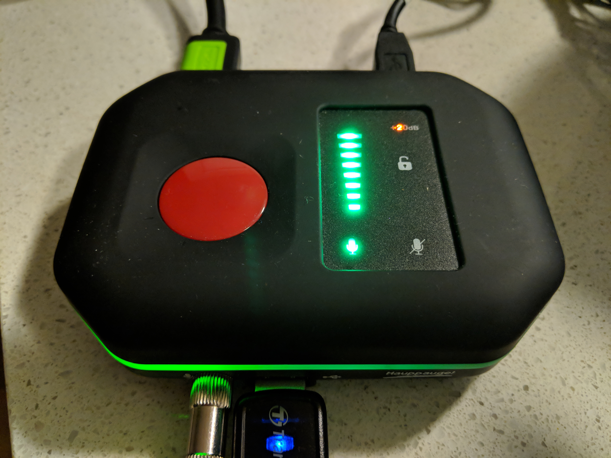

cs046-problem_set_2_example
===========================
Image test using HTML syntax: 
<a href="images/HauppagueImageTest.jpg?raw=true" target="_blank">

</a>

Image test using syntax from [Github] (https://guides.github.com/features/mastering-markdown/)

![ReadyToGo] (/images/HauppagueImageTest.jpg)
